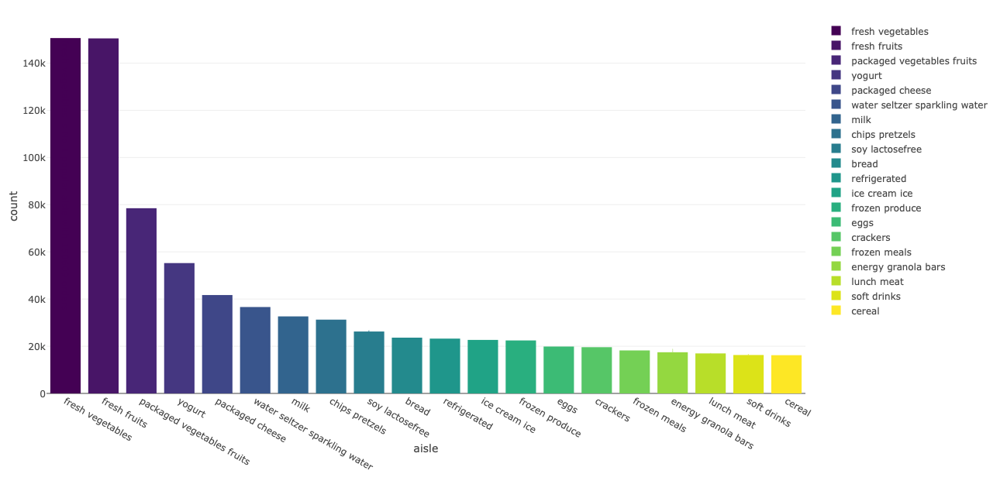
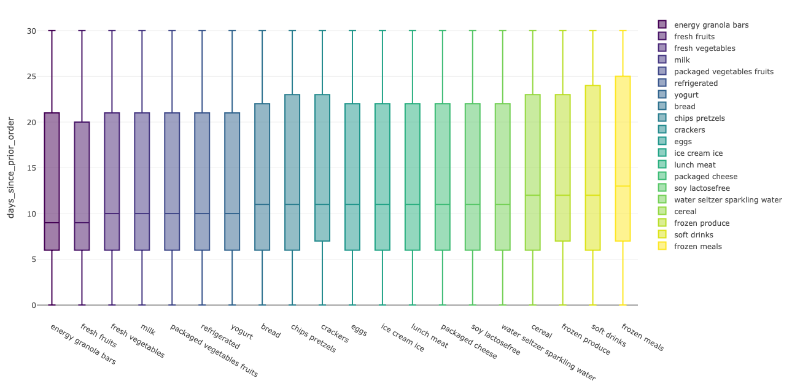
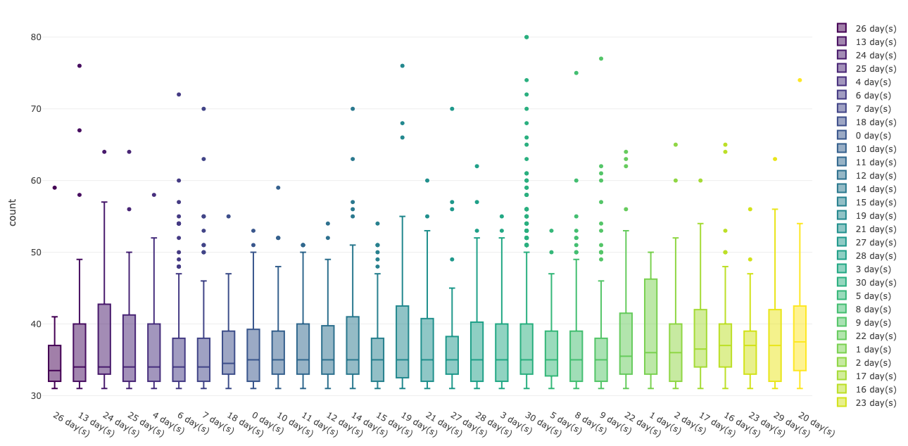
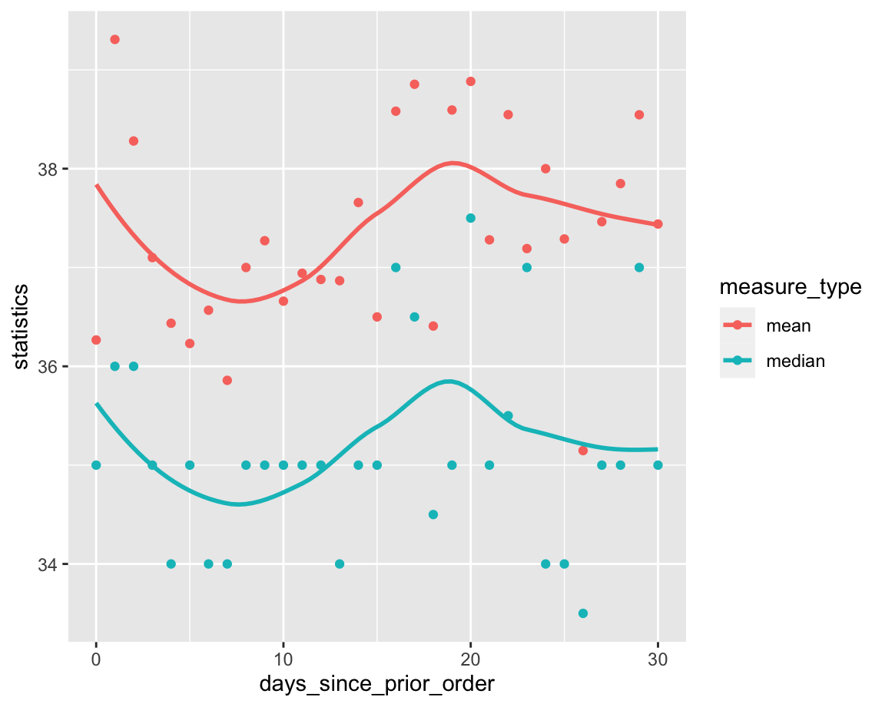

# Congratulation !!! 

This is Yiming's first website. And the following picture shows his favorite game character.(NieR: Automata)

# Instruction
This website mainly includes Yiming's personal information and his github address. You can find personal information about Yiming by clicking following "[about me](https://chongchongknight.github.io/about.html)" button or "about me" button on the top right of the website. 

If you want to contact me, you can click "letter" button on the top right of the website to email me or you can find my phone and address at the end of website.

If you want to check my github, you can click the "cat" button on the top right of the website. 

# Instacart 
In this section, Yiming is trying to analyse instacart shopping data. If you want to see plots carefully, you can click the "dashboard" button on the top left of website.

## The 20 most popular aisles in instacart

This plot shows the 20 most popular aisles in instacart. I mainly measure popularity through number of aisle purchased in specific time period.

## Shopping interval for the 20 most popular aisles in instacart

Since we already know the 20 most popular aisles in instacart, we also want to know how long would the shopping time interval be for these 20 aisles. In this case, we only choose those who have made more than 10 orders in instacart. In general, we find that counts of aisles show their popularity, while shopping time intervals of aisles tend to show "Shelf Life"(fresh ones have smaller interval while frozen ones have bigger interval). However, we need more evidence to prove our point.

## Shopping interval and number of one-time purchases

In this section, we want to know whether there is association between shopping time interval and number of one-time purchase. (According to common sense, the more items you buy at once, the longer the time between purchases should be).

In this case, we only choose those who purchase more than 30 items at a time. Actually if variable days since prior order could be double, it would be more convenient to see association. However, variable days since prior order is int variable in our dataframe. So we take time interval as categorical variable, and we use boxplot to show distribution of items number of one-time purchases with respect to specific shopping time interval.

It is more convenient to get association from the smooth line. In fact, the number of purchases fluctuates as the time interval increases.

<h1 style="text-align:right">Contact Me</h1>

Yiming LI

917-294-9193

100 Haven Ave, NY

NY, 10032

Email: yl4925@cumc.columbia.edu
