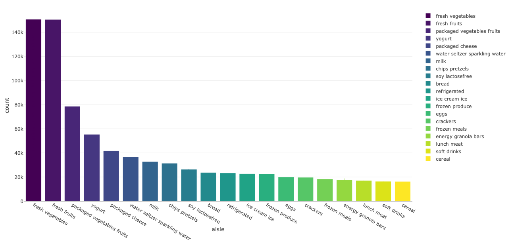
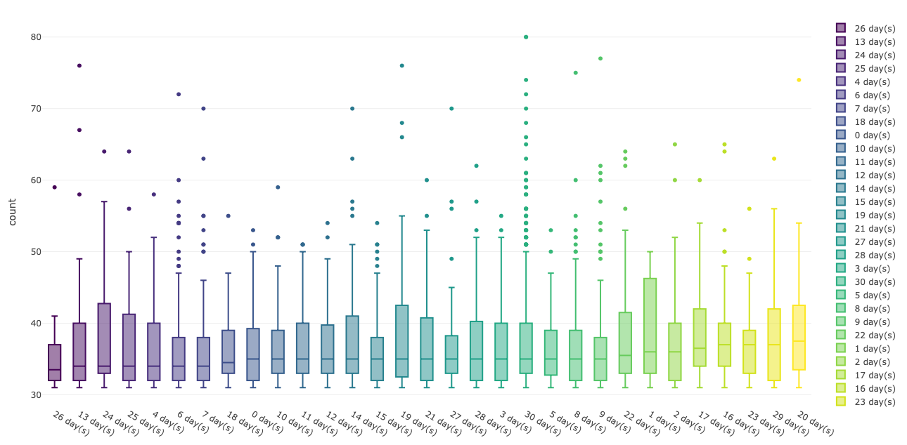
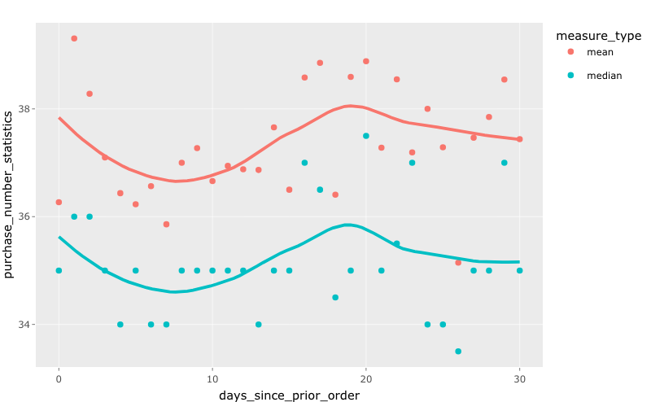

# Instacart 
In this section, Yiming is trying to analyze instacart shopping data. If you want to see plots carefully, you can click the "Dashboard" button on the top left of website. 

## The 20 most popular aisles in instacart

This plot shows the 20 most popular aisles in instacart. I mainly measure popularity through number of aisle purchased in specific time period.

## Shopping interval for the 20 most popular aisles in instacart

Since we already know the 20 most popular aisles in instacart, we also want to know how long would the shopping time interval be for these 20 aisles. In this part, we only select users who have made more than ten purchases on instacart. In general, we find that counts of aisles show their popularity, while shopping time intervals of aisles may show "Shelf Life"(fresh ones have smaller interval while frozen ones have bigger interval). However, we need more evidence to prove our point.

## Shopping interval and number of one-time purchases

In this section, we want to know whether there is association between shopping time interval and number of one-time purchase. (According to common sense, the more items you buy at once, the longer the time between purchases should be).

In this part, we only select those who have accumulated more than thirty purchases. Actually if variable "days since prior order" could be dbl, it would be more convenient to see association (sinc we could use scatter plot). However, variable "days since prior order" is int variable in our dataframe. So we take time interval as categorical variable, and we use boxplot to show distribution of items number of one-time purchases with respect to specific shopping time interval.

We can also calculate and graph the mean and median number of purchases at a fixed time interval. It is more convenient to get association from the smooth line. In fact, the number of purchases fluctuates as the time interval increases.
